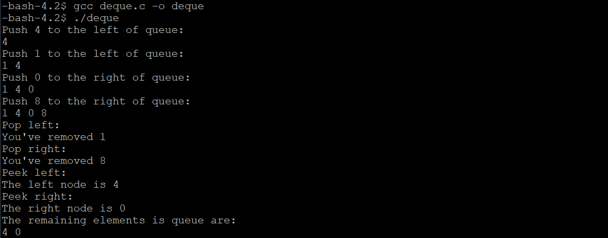

# Deque

## Description
Here is the source code of a deque data structure. The C program is successfully compiled and run on a Linux system. The program output is shown below.

## Files
* deque.h (A deque definition and its function prototypes)
* deque.c (Implementations of all functions)

## How to run
```
gcc deque.c -o deque
./deque
```

## Output

